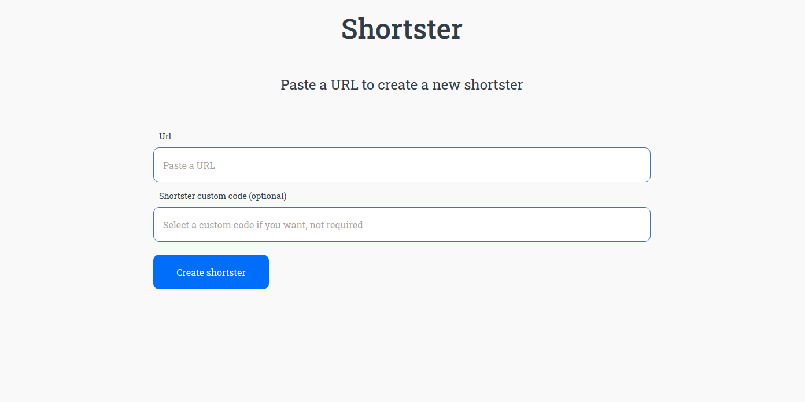

[![Contributors][contributors-shield]][contributors-url]
[![Forks][forks-shield]][forks-url]
[![Stargazers][stars-shield]][stars-url]
[![Issues][issues-shield]][issues-url]

<!-- PROJECT LOGO -->
<br />
<p align="center">
    

  <h3 align="center">Shortster Web</h3>

  <p align="center">
    A simple webpage to create codes to shorten URL links.
    <br />
    <a href="https://github.com/Torres-ssf/shortster-web/issues">Report Bug</a>
    ·
    <a href="https://github.com/Torres-ssf/shortster-web/issues">Request Feature</a>
  </p>
</p>



<!-- ABOUT THE PROJECT -->

## About The Project

This simple webpage was created to consume a [RESTful API](https://github.com/Torres-ssf/shortster-api) designed to create Shortster, codes to shorten URL links.

## Features

1. Users can create new shortster, providing or not a custom code.

2. Users can access `/:code` route to be redirect to the shortster URL page.

3. Users can access `/:code/stats` route to see shortster stats info.


### Built With

The project was built using the following languages stacks:

```sh
Front-End(client-side)
```

- [React](https://github.com/facebook/react)
- Typescript
- [Styled-Components](https://styled-components.com/)
- [Axios](https://www.npmjs.com/package/axios)
- [uuid](https://www.npmjs.com/package/uuid)
- [React-Icons](https://react-icons.github.io/react-icons/)
- [React-Spring](https://www.react-spring.io/)
- [Yup](https://www.npmjs.com/package/yup)

<!-- GETTING STARTED -->

## Getting Started

To get a local copy up and running follow these simple example steps.

### Prerequisites

- NPM

### Installation

1. Clone the repo

```sh
git clone https://github.com/Torres-ssf/shortster-web/
```

2. CD into the project root directory

```sh
cd shortster-web/
```

3. Install npm packages

```sh
yarn
```

4. This simple webpage was created to consume a [RESTful API](https://github.com/Torres-ssf/shortster-api). To make it work locally at your system, you will need to first:
  - Go to the [API repository](https://github.com/Torres-ssf/shortster-api) and setup the API - - into your system.
  - Make a copy of the `.env.example` file and rename the copy to `.env`.
  - Start the API server locally.
  - Start this app locally.

## Usage

In the project directory, you can run:

```JS
yarn start
```
- Runs the app in the development mode.<br />

```JS
yarn build
```
- Script to deploy the app in production mode.<br />


## 🤝 Contributing

Contributions, issues and feature requests are welcome!

Feel free to check the [issues page](https://github.com/Torres-ssf/shortster-web/issues).

## Authors

👤 **Torres-ssf**

- Github: [@Torres-ssf](https://github.com/Torres-ssf)
- Twitter: [@torres_ssf](https://twitter.com/torres_ssf)
- Linkedin: [torres-ssf](https://www.linkedin.com/in/torres-ssf/)

<!-- LICENSE -->

## 📝 License

This project is [MIT](LICENSE.md) licensed.

<!-- MARKDOWN LINKS & IMAGES -->

[contributors-shield]: https://img.shields.io/github/contributors/Torres-ssf/shortster-web.svg?style=flat-square
[contributors-url]: https://github.com/Torres-ssf/shortster-web/graphs/contributors
[forks-shield]: https://img.shields.io/github/forks/Torres-ssf/shortster-web.svg?style=flat-square
[forks-url]: https://github.com/Torres-ssf/shortster-web/network/members
[stars-shield]: https://img.shields.io/github/stars/Torres-ssf/shortster-web.svg?style=flat-square
[stars-url]: https://github.com/Torres-ssf/shortster-web/stargazers
[issues-shield]: https://img.shields.io/github/issues/Torres-ssf/shortster-web.svg?style=flat-square
[issues-url]: https://github.com/Torres-ssf/shortster-web/issues